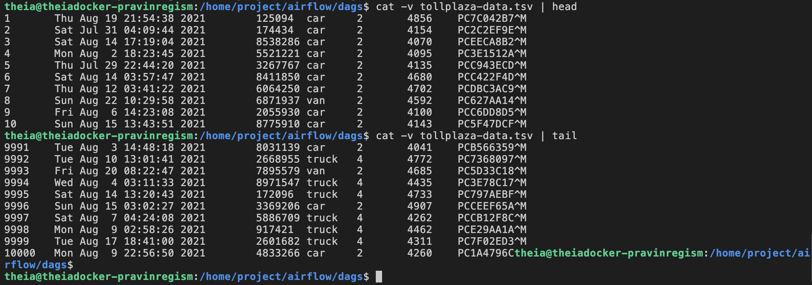

# Traffic Flow Optimization with Airflow and Kafka


[](https://opensource.org/licenses/Apache-2.0)
[](https://shields.io/)

## Disclaimer

This repository contains my submission for the Final Assignment, consisting of ***Hands-on Lab: Build an ETL Pipeline using Bash with Airflow*** and ***Hands-on Lab: Build a Streaming ETL Pipeline using Kafka***. The original files were provided by the IBM Skills Network as part of the **[ETL and Data Pipelines with Shell, Airflow and Kafka](https://www.coursera.org/learn/etl-and-data-pipelines-shell-airflow-kafka)** course on Coursera.

### Usage

* You are welcome to use this repository as a reference or starting point for your own assignment.

* If you choose to fork this repository, please ensure that you comply with the terms of the Apache License and give proper credit to the orginal authors.

## Objectives

* Create an ETL pipeline using an Airflow DAG
* Build a streaming ETL pipeline using Kafka

## Project Scenario

As a data engineer, I am tasked with a project that seeks to alleviate congestion on national highways. To do so, I must analyze road traffic data from various toll plazas. Here’s the catch: each highway is managed by a different toll operator, and their IT systems employ different file formats. My challenge lies in harmonizing this disparate data to derive meaningful insights and contribute to smoother traffic flow. Following that, I need to create a data pipeline to collect the timestamp data streamed to Kafka and load it into a database. The high-level approach was to:

* Collect data available in different formats and consolidate it into a single file.
* Create a data pipeline that collects the streaming data and loads it into a database.

## Project layout

This repository contains all of the source files, scripts, and output files for the final assignment. Additional scripts have been provided in lieu of screenshots for various tasks.

```text
├── bash                                     <- Build an ETL Pipeline using Bash with Airflow
│   └── airflow/                             <- AIRFLOW_HOME
│       └── dags/                            <- DAGS_FOLDER
│           ├── csv_data.csv                 <- Extracted data from vehicle-data.csv
│           ├── ETL_toll_data.py             <- ETL_toll_data DAG using BashOperator
│           ├── Extract_Transform_data.sh    <- Shell script for ETL tasks
│           ├── extracted_data.csv           <- Consolidated data from extracted files
│           ├── fixed_width_data.csv         <- Extracted data from payment-data.txt
│           ├── payment-data.txt             <- Fixed width file
│           ├── tolldata.tgz                 <- Source data tarball
│           ├── tollplaza-data.tsv           <- Tab-separated values file  (see Notes)
│           ├── transformed_data.csv         <- Transformed extracted data
│           ├── tsv_data.csv                 <- Extracted data from tollplaza-data.tsv
│           └── vehicle-data.csv             <- Comma-separated values file
├── kafka                            <- Creating Streaming Data Pipelines using Kafka
│   ├── create_topic_toll.sh         <- Exercise 2.3 - Create a topic named 'toll'
│   ├── kafka_install.sh             <- Exercise 1 - Prepare the lab environment (Steps 1-2)
│   ├── start_kafka.sh               <- Exercise 2.2 - Start Kafka server
│   ├── start_zookeeper.sh           <- Exercise 2.1 - Start Zookeeper
│   ├── streaming_data_reader.py     <- Customized Streaming Data Consumer program
│   └── toll_traffic_generator.py    <- Customized Toll Traffic Simulator program
├── mysql
│   ├── livetolldata_health.sh    <- Exercise 2.9 - Health check of the streaming data pipeline
│   └── mysql_prep.sh             <- Exercise 1 - Prepare the lab environment (Steps 3-9)
└── python                                      <- Build an ETL Pipeline using Airflow *
    └── airflow/                                <- AIRFLOW_HOME
        └── dags/                               <- DAGS_FOLDER
            └── finalassignment/                <- finalassignment folder
                ├── staging/                    <- staging folder
                │   ├── ETL_toll_data.py        <- ETL_toll_data DAG using PythonOperator
                │   └── transformed_data.csv    <- Transformed extracted data
                ├── csv_data.csv                <- Extracted data from vehicle-data.csv
                ├── extracted_data.csv          <- Consolidated data from extracted files
                ├── fixed_width_data.csv        <- Extracted data from payment-data.txt
                ├── payment-data.txt            <- Fixed width file
                ├── tolldata.tgz                <- Source data tarball
                ├── tollplaza-data.tsv          <- Tab-separated values file
                ├── transformed_data.csv        <- Transformed extracted data
                ├── tsv_data.csv                <- Extracted data from tollplaza-data.tsv
                └── vehicle-data.csv            <- Comma-separated values file

* NOTE: For the final assignment, you have the option to complete either the Bash or Python
        lab for Airflow. Additionally, I’ve included an ETL_toll_data DAG that utilizes
        PythonOperator, an operator not covered in this course.   
```

## Directions

### Final Assignment (Part 1) - Creating ETL Data Pipelines using Bash with Apache Airflow

#### Create a python script `ETL_toll_data.py` as the Apache Airflow DAG

1. Define the DAG arguments as per the following details:

    | Parameter | Value |
    | --------- | ----- |
    | owner | \<You may use any dummy name> |
    | start_date | today |
    | email | \<You may use any dummy email> |
    | email_on_failure | True |
    | email_on_retry | True |
    | retries | 1 |
    | retry_delay | 5 minutes |

1. Create a DAG as per the following details:

    | Parameter | Value |
    | --------- | ----- |
    | DAG id | `ETL_toll_data` |
    | Schedule | Daily once |
    | default_args | as you have defined in the previous step |
    | description | Apache Airflow Final Assignment |

#### Create a shell script `Extract_Transform_data.sh` and add the following commands to your tasks:

3. Write a command to unzip the data. Use the downloaded data from the url given and uncompress it into the destination directory.
1. Update the shell script to add a command to extract data from csv file. You should extract the fields: `Rowid`, `Timestamp`, `Anonymized Vehicle number`, and `Vehicle type` from the `vehicle-data.csv` file and save them into a file named `csv_data.csv`.
1. Update the shell script to add a command to extract data from tsv file. You should extract the fields: `Number of axles`, `Tollplaza id`, and `Tollplaza code` from the `tollplaza-data.tsv` file and save it into a file named `tsv_data.csv`.
1. Update the shell script to add a command to extract data from fixed width file. You should extract the fields: `Type of Payment code`, and `Vehicle Code` from the fixed width file `payment-data.txt` and save it into a file named `fixed_width_data.csv`.
1. Update the shell script to add a command to consolidate data extracted from previous tasks. You should create a single csv file named `extracted_data.csv` by combining data from the following files:<br>
    * `csv_data.csv`
    * `tsv_data.csv`
    * `fixed_width_data.csv`

    The final csv file should use the fields in the order given below:<br>
    `Rowid`, `Timestamp`, `Anonymized Vehicle number`, `Vehicle type`, `Number of axles`, `Tollplaza id`, `Tollplaza code`, `Type of Payment code`, and `Vehicle Code`
1. Update the shell script to add a command to transform and load the data. You should transform the `Vehicle type` field in `extracted_data.csv` into capital letters and save it into a file named `transformed_data.csv`.
1. Create a task `extract_transform_load` in the `ETL_toll_data.py` to call the shell script.
1. Submit the DAG.
1. Unpause the DAG.
1. Monitor the DAG.

### Final Assignment (Part 2) - Creating Streaming Data Pipelines using Kafka

1. Start a MySQL Database server.
1. Create a table to hold the toll data.
1. Start Zookeeper server.
1. Start Kafka server.
1. Create a Kafka topic named `toll`.
1. Download the Toll Traffic Simulator `toll_traffic_generator.py` program.
1. Configure the Toll Traffic Simulator and set the topic to `toll`.
1. Run the Toll Traffic Simulator program.
1. Download the Streaming Data Consumer `streaming_data_reader.py` program.
1. Customize the consumer program to write into a MySQL database table.
1. Run the Streaming Data Consumer program.
1. Verify that streamed data is being collected in the database table.

## Notes

While working on the final assignment, I encountered an issue with the `tollplaza-data.tsv` file within the `tolldata.tgz` compressed tarball. It turned out that this TSV file contained `^M` characters, which are carriage return characters. These characters likely originated from an incorrect file transfer mode. As a consequence, the consolidated extracted data within `extracted_data.csv` was split into two lines per row.



In response to this issue, I’ve presented two potential solutions:

### Solution 1: Update `tollplaza-data.tsv` File in `tolldata.tgz`

Decompress the TGZ file:

```bash
gzip -d tolldata.tgz
```

Extract the files from the `tolldata.tar` archive

```bash
tar xvf tolldata.tar
```

Use the stream editor `sed` to remove the `^M` characters.<br>
To enter `^M`, hold down the CTRL key then press V and M in succession.

```bash
sed 's/^M//' tollplaza-data.tsv > _tollplaza-data.tsv
```

Rename _tollplaza-data.tsv to original filename:

```bash
mv _tollplaza-data.tsv tollplaza-data.tsv
```

Next, update the archive with the modified file:

```bash
tar -uf tolldata.tar tollplaza-data.tsv
```

Finally, compress the updated archive:

```bash
gzip tolldata.tar
```

Rename compressed tarball to .tgz extension:

```bash
mv tolldata.tar.gz tolldata.tgz
```

### Solution 2: Use `awk` to Remove Carriage Return Characters

Using `awk '{gsub(/\r/,""); print}'` to globally replace carriage return characters with an empty string. The resulting modified line is then available for further processing.

```bash
cut -f5-7 /home/project/airflow/dags/tollplaza-data.tsv | awk '{gsub(/\r/,""); print}' | tr "\t" "," > /home/project/airflow/dags/tsv_data.csv
```

Both solutions will successfully correct the problem and ensured that the consolidated data remains intact.

## Setup

Install the required libraries using the provided `requirements.txt` file. The command syntax is:

```bash
python3 -m pip install -r requirements.txt
```

Create a directory structure for staging area as follows:

```bash
sudo mkdir -p /home/project/airflow/dags/finalassignment/staging
```

Execute the folllowing commands to avoid any permission issues:

```bash
# bash
sudo chown -R 100999 /home/project/airflow/dags
sudo chmod -R g+rw /home/project/airflow/dags

# python
sudo chown -R 100999 /home/project/airflow/dags/finalassignment
sudo chmod -R g+rw /home/project/airflow/dags/finalassignment  
sudo chown -R 100999 /home/project/airflow/dags/finalassignment/staging
sudo chmod -R g+rw /home/project/airflow/dags/finalassignment/staging
```

Download the required dataset to the destination specified using the terminal command:

```bash
# bash
sudo wget -P /home/project/airflow/dags https://cf-courses-data.s3.us.cloud-object-storage.appdomain.cloud/IBM-DB0250EN-SkillsNetwork/labs/Final%20Assignment/tolldata.tgz

# python
sudo wget -P /home/project/airflow/dags/finalassignment https://cf-courses-data.s3.us.cloud-object-storage.appdomain.cloud/IBM-DB0250EN-SkillsNetwork/labs/Final%20Assignment/tolldata.tgz
```

Download Toll Traffic Simulator program:

```bash
sudo wget https://cf-courses-data.s3.us.cloud-object-storage.appdomain.cloud/IBM-DB0250EN-SkillsNetwork/labs/Final%20Assignment/toll_traffic_generator.py
```

Download Streaming Data Consumer program:

```bash
sudo wget https://cf-courses-data.s3.us.cloud-object-storage.appdomain.cloud/IBM-DB0250EN-SkillsNetwork/labs/Final%20Assignment/streaming_data_reader.py
```

## Learner

[Pravin Regismond](https://www.linkedin.com/in/pregismond)

## Acknowledgments

* IBM Skills Network © IBM Corporation 2021. All rights reserved.
